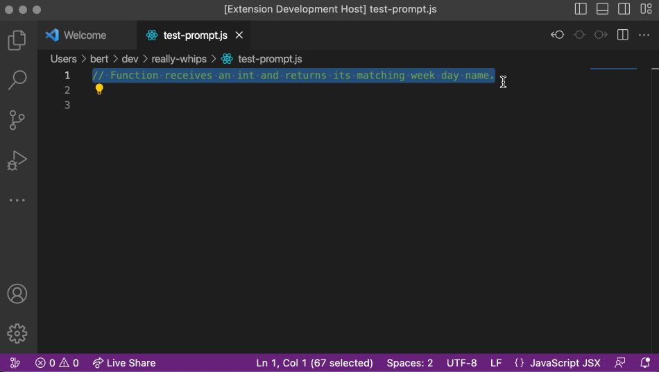

# really-whips 🦙

Tiny wrapper on top of [alpaca.cpp](https://github.com/codealchemist/alpaca.cpp).

Lets you select a prompt in VSCode and hit Alpaca with it to get a response in place.

It really whips the LLaMA's ass! 😆

## Install Alpaca

Use the provided intall command: `Install Alpaca 🦙`

## Usage

Select any text in your document and invoke the command `Hit LLaMA with selected prompt`.

The file type (IE: `javascriptreact`) + selected text will be sent to Alpaca as prompt.

The response will be written right after the selected text.

Alpaca will be started when the first prompt is sent and kept alive until the VSCode instance is closed.

As you can see it's not perfect, but it was close! 😂

We should keep trying with other models.

## Contribute

It would be nice to provide better user feedback and to be able to cancel an already started Alpaca query.

If you have time to do this or have other ideas you'd love to implement, please, share it 🙌

Fork this repo, make and test your changes, then create a PR.

Cheers!
